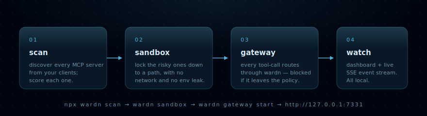
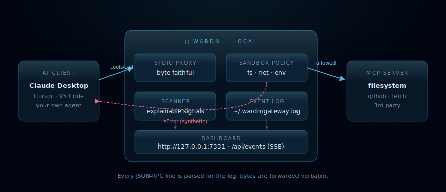
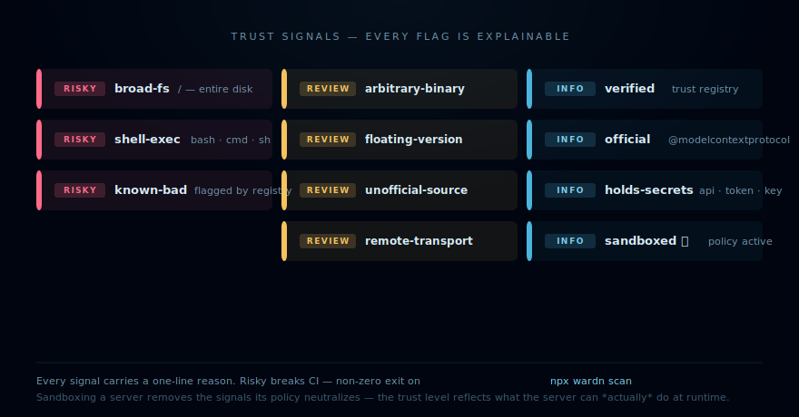
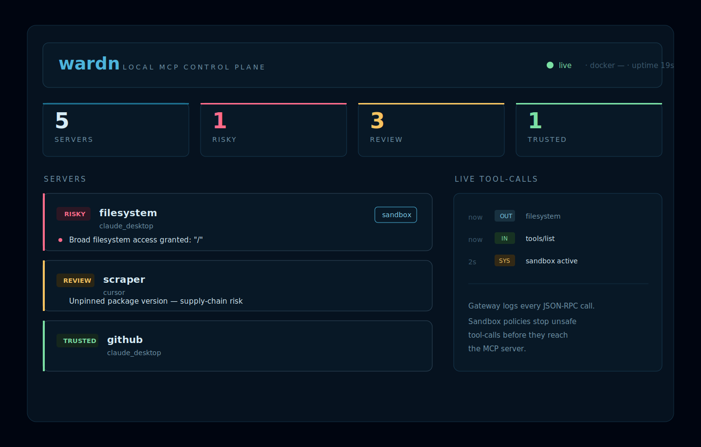

<div align="center">

# ⛨ wardn

**See and stop the risky code your AI agents run.**

A local-first MCP control plane for developers using Claude Desktop, Cursor, VS Code, Codex, or
custom agents. One command discovers every MCP server you have, scores it for risk, routes every
tool-call through a local gateway, and lets you sandbox the dangerous ones.

[](https://www.npmjs.com/package/wardn)
[](https://github.com/lynuxis2026-pixel/wardn/actions/workflows/ci.yml)
[](#tested)
[](LICENSE)
[](package.json)

[Quickstart](#quickstart) · [How it works](#how-it-works) · [Trust signals](#trust-signals) · [Commands](#commands) · [Architecture](docs/ARCHITECTURE.md) · [Security](SECURITY.md)

</div>

---



> _`npx wardn demo` runs a bundled malicious MCP server through the gateway and blocks every attack before the server sees the call. The demo is reproducible — see [examples/evil-mcp](examples/evil-mcp/)._

---

## Why wardn

You're running MCP servers in Claude Desktop, Cursor, or your own agent. Each one is **code with real
permissions**: filesystem access, network, shell, your API tokens. There are thousands of MCP servers
in the wild and no easy way to see what's actually running, what it can touch, or whether to trust it.

`wardn` is the local, developer-first answer. No cloud account. No telemetry. No enterprise console.

```bash
npx wardn scan
```

```text
Found 5 MCP servers across 2 clients

  ● RISKY    filesystem           (claude_desktop)
             ↳ Broad filesystem access granted: "/"
  ○ REVIEW   remote-notion        (cursor)
             ↳ Remote server — data leaves your machine
  ○ REVIEW   scraper              (cursor)
             ↳ Unpinned package version (cool-scraper-mcp) — supply-chain risk
  ○ REVIEW   weird                (cursor)
             ↳ Unrecognized launcher: "/usr/local/bin/custom-mcp"
  ✓ TRUSTED  github               (claude_desktop)

  5 servers · 1 risky · 3 review · 1 trusted
```

Exits non-zero if anything risky is found — drop it into CI and you have a regression test for
"what's installed on my dev machine."

---

## How it works



Four small commands and the work is done.

| | Command | What happens |
|---|---|---|
| **01** | `npx wardn scan` | Reads Claude Desktop / Cursor / VS Code MCP configs and scores every server with explainable signals. |
| **02** | `npx wardn sandbox enable <name>` | Writes a per-server policy: filesystem whitelist, network on/off, env-whitelist. Stored at `~/.wardn/policy.json`. |
| **03** | `npx wardn gateway start` | Local Fastify daemon + stdio proxy. Every `tools/call` is vetted before the MCP server sees it. |
| **04** | open the dashboard | Lynuxis-styled console at `http://127.0.0.1:7331`, with live tool-call log over SSE. |

Optional fifth step: `npx wardn rewrite apply` rewrites your client configs so every server you've
ever installed routes through the gateway from now on. Backed up byte-for-byte; one command undoes it.

---

## The picture



The gateway sits between the client and the server. Bytes are forwarded **verbatim** — the wire
format stays identical. Every JSON-RPC message is parsed alongside the wire to drive the log and the
sandbox enforcer. A blocked `tools/call` is returned to the client as a synthetic JSON-RPC `result`
with `isError: true` — no server contact, no surprise side effect.

For a deeper walkthrough see [docs/ARCHITECTURE.md](docs/ARCHITECTURE.md).

---

## Trust signals



Every flag has a one-line `reason`. No black box.

| Signal | Severity | Triggered when |
|---|---|---|
| `broad-fs` | risky | A server arg is `/`, `~`, or a top-level system directory |
| `shell-exec` | risky | The launcher is `bash`, `cmd`, `sh`, or another raw shell |
| `known-bad` | risky | The package is flagged in [`data/trust.json`](data/trust.json) |
| `arbitrary-binary` | review | The launcher is an unrecognized executable |
| `floating-version` | review | A community package is run unpinned (supply-chain risk) |
| `unofficial-source` | review | The package is not from a verified publisher |
| `remote-transport` | review | The server is `url:` based — data leaves your machine |
| `verified` | info | The package matches a verified publisher in the trust registry |
| `official` | info | The package is `@modelcontextprotocol/*` |
| `holds-secrets` | info | Env keys look like API/TOKEN/KEY/PASSWORD |
| `sandboxed` | info | A wardn policy is active for this server |

> ⛨ Sandboxing a server **removes** the signals the policy neutralizes — a `broad-fs` server pinned to
> `~/safe-workspace` drops out of `RISKY` because that broad access can no longer happen at runtime.

---

## Quickstart

### 1. Scan

```bash
npx wardn scan
```

Reads the config of every MCP-capable client installed locally; scores each server.

### 2. Sandbox the risky one

```bash
npx wardn sandbox enable filesystem --path ~/safe-workspace
```

```text
✓ Sandbox enabled for filesystem

  filesystem  /Users/you/safe-workspace
  network     off
  env         (baseline only)
  isolation   policy-only (Docker not detected)

  Run wardn gateway run filesystem to spawn the server inside the sandbox.
```

Re-scan:

```text
✓ TRUSTED  filesystem           (claude_desktop)  ⛨ sandboxed
           ⛨ fs=[/Users/you/safe-workspace], network=off, env-whitelist=0
```

### 3. Start the gateway + dashboard

```bash
npx wardn gateway start
```

```text
wardn gateway — daemon up

  dashboard  http://127.0.0.1:7331/
  status     http://127.0.0.1:7331/api/status
  events     http://127.0.0.1:7331/api/events  (SSE)
  log        ~/.wardn/gateway.log
```

The dashboard shows every server, its trust level, the policy in effect, and a live stream of
JSON-RPC tool-calls. One click sandboxes a server.



### 4. Route existing clients through wardn

```bash
npx wardn rewrite apply       # rewrites Claude Desktop / Cursor / VS Code configs (with backup)
npx wardn rewrite restore     # undo, byte-for-byte
npx wardn rewrite status      # see what's active
```

Restart your client; every MCP tool-call now flows through the local gateway.

### 5. Prove it works

```bash
npx wardn demo
```

Spawns the bundled [evil-mcp](examples/evil-mcp/) through the gateway under a tight sandbox, fires
four attack vectors (path traversal, exfiltration, destructive command, shell injection), and shows
each one rejected before the server is reached.

### 6. Keep it healthy

```bash
npx wardn doctor                                 # diagnose the local setup
npx wardn watch --once                           # CI mode: exits non-zero on a new risky finding
npx wardn report --stdout > trust.md             # markdown trust report for stakeholders
npx wardn registry update                        # pull the latest curated trust data
```

`wardn watch` keeps a snapshot at `~/.wardn/scan-snapshot.json` so it can show diffs — `+ new risky
server`, `~ X went from RISKY to TRUSTED`, `- Y removed`. `wardn registry update` writes a live
override at `~/.wardn/trust-registry.json` that the scanner prefers over the bundled data.

---

## Trust registry — the community layer

wardn ships a curated [`data/trust.json`](data/trust.json) mapping known MCP packages to a verified
publisher (Anthropic, Microsoft Playwright, Notion, Upstash, Cloudflare, …). The scanner uses it on
top of the heuristics — an official server shows `Verified publisher: Anthropic`, a `knownBad: true`
entry is treated as `RISKY` regardless of how innocent the config looks.

**Spot a server we should add — or one we should flag?** Open a
[Trust registry entry](https://github.com/lynuxis2026-pixel/wardn/issues/new?template=trust-registry.yml).
Every entry is a one-screen YAML form, and good ones land within a release.

---

## How sandboxing actually works

When a policy is enabled, wardn enforces it in **two layers**:

1. **Spawn-time policy.** Known servers like `@modelcontextprotocol/server-filesystem` are spawned with
   restricted positional path arguments. Env vars are filtered down to a baseline set plus your
   explicit `envWhitelist`. When Docker is available the process additionally runs in a container
   with `--network none` and read-only mounts.
2. **Runtime tool-call policy.** Outgoing `tools/call` JSON-RPC messages are inspected. wardn
   rejects:
   - any path argument that falls outside `policy.filesystem.paths`
   - any URL anywhere in the arguments while `policy.network: false`
   - any tool whose name tokenizes to a dangerous keyword (`shell`, `exec`, `run`, `spawn`, `eval`,
     `command`, `cmd`, `process`, `system`) — `runQuery`, `shellExec`, `shell_exec` all match.
     Opt back in for specific tools via `policy.allowedTools`.

All policy state lives at:

```text
~/.wardn/policy.json      sandbox policies
~/.wardn/gateway.log      JSON-RPC event log (NDJSON)
~/.wardn/backups/         client config backups
~/.wardn/rewrites.json    active rewrite index
~/.wardn/sandboxes/<name>/  per-server default sandbox roots
```

`WARDN_HOME=/tmp/wardn-test` overrides the root, used by every test to keep the real user state
untouched.

---

## Commands

```text
wardn scan                           [--from <dir>] [--json]
wardn sandbox enable <name>          [--path <dir>]... [--allow-network] [--allow-env <key>]...
wardn sandbox disable <name>
wardn sandbox status                 [<name>]
wardn gateway run <name>             [--from <dir>]
wardn gateway start                  [--port <n>] [--host <h>] [--from <dir>]
wardn rewrite apply                  [--client <c>] [--invoke <tpl>] [--from <dir>] [--dry-run]
wardn rewrite restore                [--client <c>] [--from <dir>]
wardn rewrite status
wardn demo                           [--fast]
wardn doctor
wardn watch                          [--once] [--interval <sec>] [--from <dir>]
wardn report                         [--stdout] [--out <file>] [--from <dir>]
wardn registry update                [--url <url>]
wardn registry status
```

Every command exits non-zero when something risky is found or a policy is breached — wardn fits
cleanly into CI.

---

## Tested

```text
$ npm run test:coverage

ℹ tests 142
ℹ pass 142
ℹ fail 0

File                 | % Stmts | % Branch | % Funcs | % Lines |
---------------------|---------|----------|---------|---------|
All files            |     100 |    91.91 |     100 |     100 |
```

Every executable statement, function and line is covered. The remaining ~8% branch gap is
nullish-coalescing defaults (`process.env.WARDN_HOME ?? os.homedir()`) — those branches would
only flip if a real user's environment is exactly the production shape, which tests deliberately
avoid touching.

CI matrix runs on Node 18 / 20 / 22 across Ubuntu, macOS, and Windows; the Ubuntu-Node-20 leg
gates coverage at lines / functions / statements = 100% and branches ≥ 90%.

Validation covers:

- gateway proxying a real `@modelcontextprotocol/server-filesystem`
- sandbox rejection before server execution (path / network / dangerous-name)
- policy store CRUD and scanner downgrade behaviour
- rewrite apply/restore with byte-identical rollback
- daemon HTTP API + SSE
- dashboard build and `npm pack --dry-run`

---

## Develop

```bash
git clone https://github.com/lynuxis2026-pixel/wardn.git
cd wardn
npm install
npm test
npm run scan -- --from fixtures
npm run dashboard:build
```

Requires Node ≥ 18. TypeScript, ESM, NodeNext imports with `.js` extensions. Five runtime deps
(`commander`, `fastify`, `@fastify/cors`, `@fastify/static`, `picocolors`). Lean by design.

---

## Roadmap

The local control plane is complete. What's still on the table:

- **team / hosted tier** with shared policies, audit trails, and cross-machine visibility — the
  paid layer; explicitly out of scope for the local OSS core.
- **marketplace signals** (npm download counts, CVE / GH advisories) merged into the trust registry.
- **model / router integrations** if there's demand from operators wanting one console for both AI
  agents and the MCP servers they call.

Everything in v0 of the roadmap shipped:

- ✅ richer Linux-native isolation (`bubblewrap` detection + spawn wrap)
- ✅ daemon auth token + loopback `/api/token`
- ✅ `wardn doctor` / `watch` / `report` / `rewrite --dry-run`
- ✅ live trust-registry override via `wardn registry update`

See [CHANGELOG.md](CHANGELOG.md) for the full release history.

---

## Contributing & security

- [CONTRIBUTING.md](CONTRIBUTING.md) — the highest-leverage PR today is a trust-registry entry.
- [SECURITY.md](SECURITY.md) — threat model + responsible disclosure mailbox. Security bugs go
  there first, not the public tracker.

A [Lynuxis](https://lynuxis.nl) project. **MIT** licensed.
