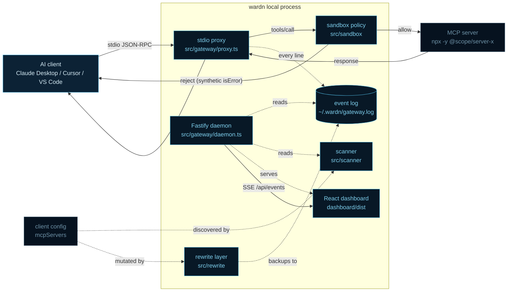

# wardn — architecture

wardn is split into five layers. Each layer is one folder under `src/` and has
exactly one job. Skim this file before changing anything that crosses a
boundary.

## Data flow



## Layers

### discovery (`src/discovery`)
Reads `mcpServers` (or `servers` for VS Code) out of the standard client
config locations on the current OS. Produces a normalized `McpServer[]`. Pure
function, no side effects, no network.

### scanner (`src/scanner`)
Takes an `McpServer` (plus an optional `ServerPolicy`) and returns a
`ScanResult` — a trust level (`trusted` / `review` / `risky`) and an array of
`Signal`s. Every signal carries a human-readable `reason` string. Rules live
in `rules.ts`; the trust registry lookup is `trust-registry.ts`. Adding a new
heuristic is a one-file change.

### sandbox (`src/sandbox`)
Two halves:

1. **Policy store** (`store.ts`, `types.ts`) — persists per-server policies
   under `~/.wardn/policy.json`. CRUD operations only.
2. **Enforcer** (`enforce.ts`) — pure functions:
   - `applySpawnPolicy(server, policy) → SpawnRewrite` rewrites command/args/
     env so the MCP server is launched with only what the policy allows.
   - `decideOutgoing(line, policy) → OutgoingDecision` looks at a single
     JSON-RPC line; returns either `allow` or a synthetic error response.

The proxy invokes both. Docker isolation (`docker.ts`) wraps `SpawnRewrite`
when the user has Docker and the policy benefits from container-level limits.

### gateway (`src/gateway`)
- `proxy.ts` — byte-faithful stdio proxy. Splits the stream into newline-
  terminated JSON-RPC messages, runs each outgoing line through the enforcer,
  forwards the raw bytes verbatim, and appends a summary entry to the logger.
- `logger.ts` — append-only NDJSON log + in-process EventEmitter.
- `daemon.ts` — Fastify app with `/api/status`, `/api/scan`,
  `POST /api/sandbox/:name`, SSE `/api/events`. Serves the React dashboard
  at `/` via `@fastify/static`. Tails the log file so cross-process proxies
  also surface on the SSE stream.
- `registry.ts` — resolves a server by name across all known clients.

### rewrite (`src/rewrite`)
Rewrites client configs so they spawn `wardn gateway run <name>` instead of
the real binary. Each rewrite snapshots the original file under
`~/.wardn/backups/<client>-<timestamp>.json`. A `~/.wardn/rewrites.json`
index maps configs to backups; `restore` overwrites the config with the
backup byte-for-byte.

## Wire format

MCP-over-stdio is **newline-delimited JSON-RPC** (not LSP-style
Content-Length framing). The proxy preserves that exactly — bytes are
forwarded verbatim. Parsing only drives the log and the enforcer; it does
not transform the wire.

A `tools/call` rejection writes a synthetic JSON-RPC `result` with
`isError: true` to the client and never touches the upstream server. This
matches the MCP convention for tool-level errors and means the client UI
shows the failure naturally.

## State on disk

```text
~/.wardn/
├── policy.json        per-server sandbox policies
├── rewrites.json      index of active client-config rewrites
├── gateway.log        NDJSON event log
├── backups/           snapshot of every config the rewrite layer mutated
└── sandboxes/<name>/  per-server default sandbox roots
```

`WARDN_HOME` overrides the root, used by every test to keep the real user
state untouched.

## Threat model

See [SECURITY.md](../SECURITY.md). In short:
- wardn protects against MCP servers reading outside their whitelist, hitting
  the network while it's disabled, and exposing dangerous-named tools.
- It does **not** protect against in-process escapes specific to the host
  language (Node `vm`, Python `ctypes`, etc.) — that's what optional Docker
  isolation is for.

## Adding a new MCP-capable client

1. Add the OS-specific config path in `src/discovery/clients.ts`.
2. Add a fixture under `fixtures/` so the scan flow has something to walk.
3. If the rewrite layer needs to handle a non-standard config shape, update
   `src/rewrite/index.ts` (currently every client uses `mcpServers` or
   `servers` — both are handled).

## Adding a new scanner signal

1. Write a `Rule` in `src/scanner/rules.ts` returning a `Signal` with a
   human-readable `reason`.
2. Append it to the `RULES` array.
3. Cover it with a test in `tests/sandbox.test.ts` (or a new file). Tests
   never use `--from` pointing at the real machine.
